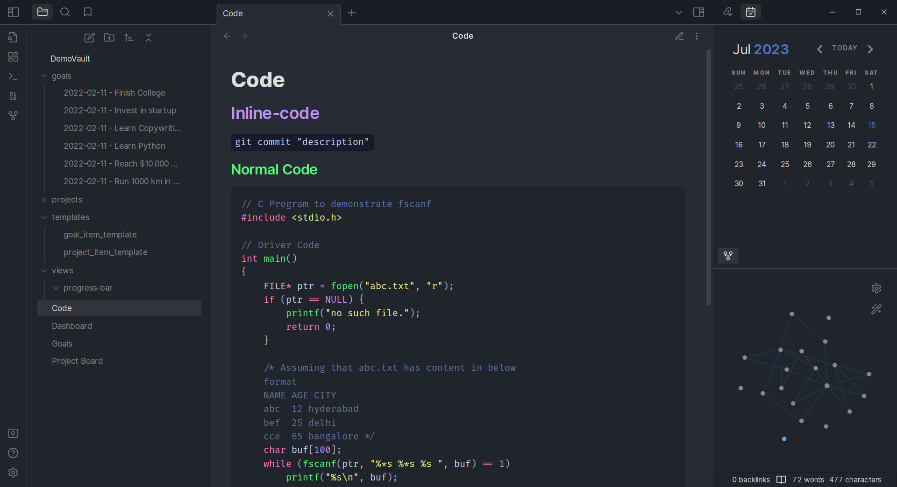
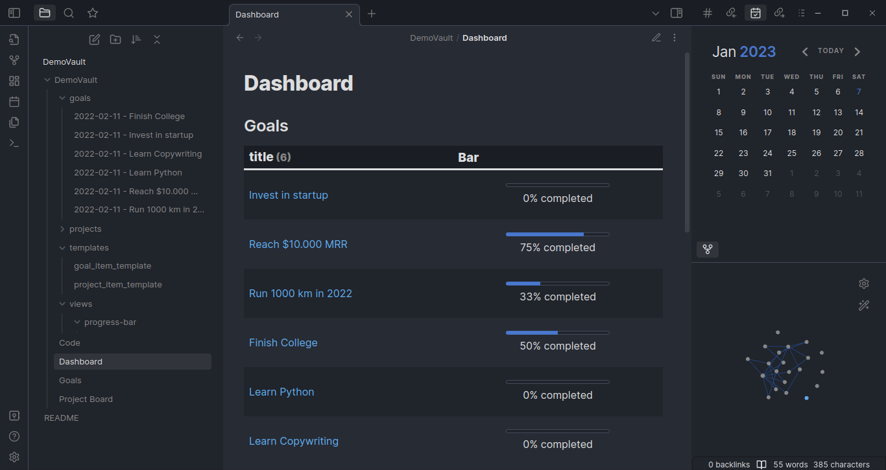

# Atomus

A theme based on the late Atom Editor.

This is a fork (duplicate) of [obsidian-atom](https://github.com/kognise/obsidian-atom) with some changes based on my opinion.

_
 [Vault](https://github.com/chhoumann/DemoVault) with Dataview and Calendar plugins 
_

- The codeblock theme is based on [Dracula](https://github.com/dracula/dracula-theme).

- New default accent color.

- Accent color can be changed.

- Graph View lines match the accent color but they're slightly darker.

- More discrete status bar.

- And some other minor changes...
